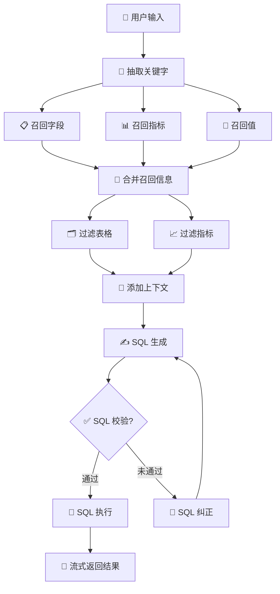

🛍️ 商品数据助手 · Shop Data Advisor
---
> 📊 **NL2SQL 智能体**：用自然语言查询电商数据仓库，自动生成并执行 SQL，流式返回结果。
---

## 📝 许可证

### 🛡️ 开源许可

本项目仅供个人学习与研究使用，采用 **MIT License** 协议。

> **💡 说明**：你可以自由地使用、修改本项目的代码进行学习。如果觉得好用，欢迎 Star 支持！

## ✨ 项目简介

商品数据助手是一个面向电商数据分析的 **NL2SQL 智能体系统**。用户输入自然语言问题（如“统计华北地区上个月各品类销售总额”），系统自动完成关键词提取、语义召回、SQL
生成与执行，通过 SSE 流式推送执行过程和查询结果。

### 🎯 核心特性

| 特性                         | 说明                                        |
|:---------------------------|:------------------------------------------|
| 🤖 **LangGraph 多节点 Agent** | 关键词抽取 → 并行语义召回 → 信息合并过滤 → SQL 生成/校验/纠正/执行 |
| 🔍 **混合语义召回**              | Qdrant 向量检索 + Elasticsearch 值召回，精准匹配字段与指标 |
| 🌊 **SSE 流式响应**            | 基于 Server-Sent Events 实时推送每个节点的执行状态和最终结果  |
| 🔗 **全链路追踪**               | 通过 `X-Request-ID` 请求头支持日志追踪，便于调试          |
| 🎨 **智能可视化**               | 内置浅色/深色主题，数值结果自动渲染为柱状图/折线图/环形图            |

---

## 🛠️ 技术栈

| 层次            | 组件                     | 图标  |
|:--------------|:-----------------------|:----|
| **Agent 框架**  | LangGraph              | 🧠  |
| **Web 框架**    | FastAPI + SSE          | ⚡   |
| **大语言模型**     | 阿里云 Qwen（兼容 OpenAI 接口） | 🤖  |
| **向量数据库**     | Qdrant                 | 📐  |
| **全文搜索**      | Elasticsearch          | 🔎  |
| **Embedding** | BAAI/bge-large-zh-v1.5 | 🔢  |
| **元数据存储**     | MySQL (meta)           | 🗄️ |
| **数据仓库**      | MySQL (dw)             | 📦  |
| **配置管理**      | OmegaConf              | ⚙️  |

---

## 📁 项目结构(部分展示)

```bash
shopDataAdvisor/
├── app/
│   ├── agent/                     # 🤖 Agent 核心逻辑 (LangGraph)
│   │   ├── graph.py               # 🔄 定义工作流图 (状态机)
│   │   ├── state.py               # 📦 定义 Agent 状态模型
│   │   └── nodes/                 # 📍 核心节点实现
│   │       ├── extract_keywords.py# 🔑 关键词抽取
│   │       ├── recall_*.py        # 🔍 混合召回 (字段/指标/值)
│   │       ├── filter_*.py        # 🛡️ 信息过滤与合并
│   │       ├── sql_generate.py    # ✍️ SQL 生成
│   │       ├── sql_vaildate.py    # ✅ SQL 校验
│   │       └── sql_execute.py     # 🚀 SQL 执行
│   ├── api/                       # 🌐 接口层
│   │   ├── routers/
│   │   │   ├── chat_router.py     # 💬 对话与 SSE 流式接口
│   │   │   └── front_router.py    # 🎨 前端静态资源路由
│   ├── client/                    # 🔌 基础设施客户端
│   ├── config/                    # ⚙️ 配置管理
│   ├── core/                      # 🛡️ 核心组件
│   │   ├── middleware.py          # 中间件 (如 RequestID)
│   │   └── lifespan.py            # 生命周期管理
│   ├── models/                    # 🗃️ 数据模型 (ORM)(关系型数据库模型)(向量数据库模型)(搜索引擎模型)
│   ├── repositories/              # 📚 数据访问层
│   ├── schemas/                   # 📝 Pydantic 数据校验模型
│   ├── service/                   # 💼 业务逻辑层
│   │   └── chat_service.py        # 聊天业务服务
│   └── prompt/                    # 📢 提示词管理
├── conf/                          # 📋 配置文件目录
├── docker/                        # 🐳 容器化部署
│   ├── docker-compose.yaml        # 编排文件
│   ├── embedding/                 # Embedding 模型文件
│   └── mysql/                     # 🗄️ 数据库初始化脚本
│   └── elasticsearch/             # 📐 els 分词器
├── frontend/                      # 🎨 前端页面
│   ├── index.html                 # 主页
│   └── index_chat.html            # 对话页
├── prompts/                       # 📝 提示词模板文件 (.prompt)
├── main.py                        # 🚪 FastAPI 入口文件
└── pyproject.toml                 # 📦 项目依赖管理
```

## 🚀 快速开始

### 1. 环境准备

**依赖服务**（需提前启动）：

| 服务            | 默认地址                  | 说明                       | 图标  |
|:--------------|:----------------------|:-------------------------|:----|
| MySQL (meta)  | `192.168.10.131:13306` | 元数据库，存储表/字段定义            | 🗄️ |
| MySQL (dw)    | `192.168.10.131:13306` | 数据仓库，业务查询目标库             | 📦  |
| Qdrant        | `192.168.10.131:16333` | 字段和指标的向量索引               | 📐  |
| Elasticsearch | `192.168.10.131:19200` | 字段值的全文索引                 | 🔎  |
| Kibana        | `192.168.10.131:5601` | ES 的可视化界面 + 数据分析平台       | 🧩  |
| Embedding 服务  | `192.168.10.131:8081` | bge-large-zh-v1.5 向量化服务  | 🔢  |

**安装 Python 依赖**：

```bash
uv lock
uv sync
```

### 2. 修改配置

编辑 `conf/app_config.yaml`，填入实际的服务地址和 LLM API Key。

### 3. 定义元数据

编辑 `conf/meta_config.yaml`，描述数据仓库的表结构和指标。

### 4. 构建元知识索引

首次启动前，将元数据写入 Qdrant 和 Elasticsearch：

```bash
python -m app.scripts.build_meta_knowledge -c conf/meta_config.yaml
```

### 5. 启动服务

```bash
uvicorn main:app --host 0.0.0.0 --port 8000 --reload
```

- **访问前端**：`http://localhost:8000` 🌐
- **Swagger 文档**：`http://localhost:8000/docs` 📚

---

## 🔄 Agent 执行流程



---

## 📡 API 说明

### `POST /api/query`

流式查询接口（SSE）。

**请求头**

| Header         | 说明               | 示例           | 图标 |
|:---------------|:-----------------|:-------------|:---|
| `X-Request-ID` | 链路追踪 ID，不传则使用默认值 | `Mobile_Car` | 🔗 |

**请求体**

```json
{
  "query": "统计华北地区上个月各品类的销售总额"
}
```

**响应流**
流式返回 `progress` (执行过程) 和 `result` (最终数据) 事件。

---

## 🎨 前端功能

前端位于 `frontend/index.html`。

| 功能        | 说明                       | 图标 |
|:----------|:-------------------------|:---|
| **智能输入**  | 自然语言输入框 + 示例快捷 Chip      | ⌨️ |
| **实时追踪**  | 显示 Agent 各节点状态（运行中 / 完成） | 📍 |
| **进度条**   | 跟踪整体执行进度                 | 📊 |
| **表格渲染**  | 自动识别数值列，支持排序             | 📋 |
| **图表可视化** | 数值结果自动生成柱状图 / 折线图        | 📈 |
| **主题切换**  | 浅色 / 深色模式切换              | 🌙 |
| **配置面板**  | 可修改 `X-Request-ID`       | ⚙️ |

---

## 🖼️ 效果展示

### 💬 对话与执行追踪

展示用户提问后，Agent 逐步执行 SQL 生成的过程。


### 📊 数据与图表可视化

展示查询结果以表格和图表（柱状图/环形图）形式呈现。


### 🔗 链路追踪配置

展示如何在前端配置 `X-Request-ID` 以进行后端日志追踪。


---

## 📧 欢迎交流

如果你在学习过程中有任何疑问，或者想探讨技术细节，**欢迎与我交流！**

📧 **邮箱**：[3120942614@qq.com]()

**Made with ❤️ by Xsy**
